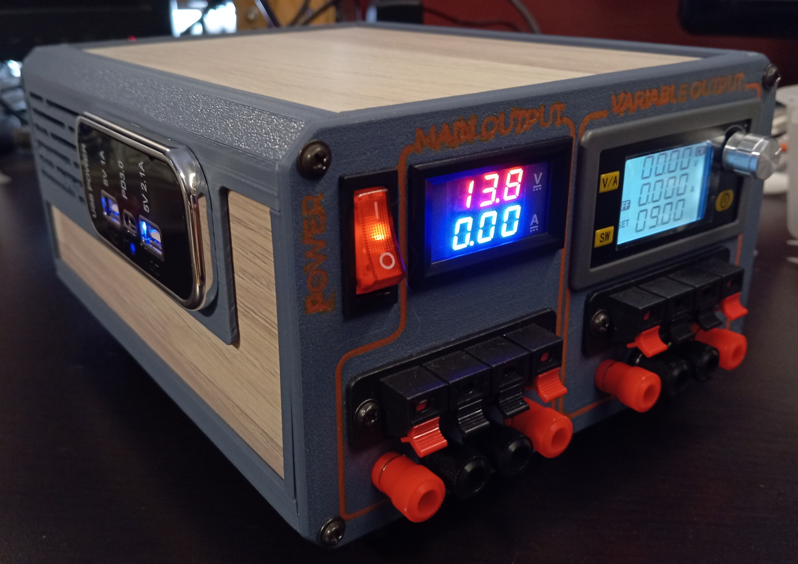
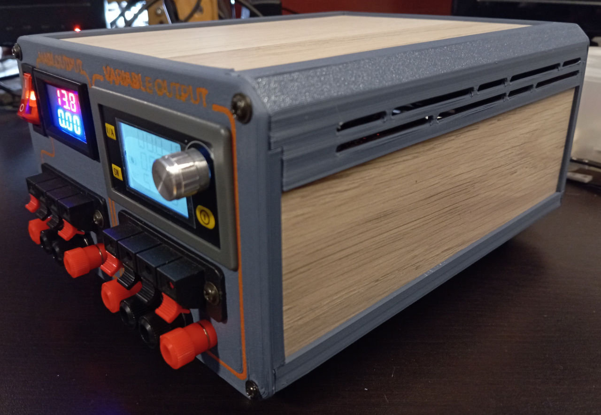
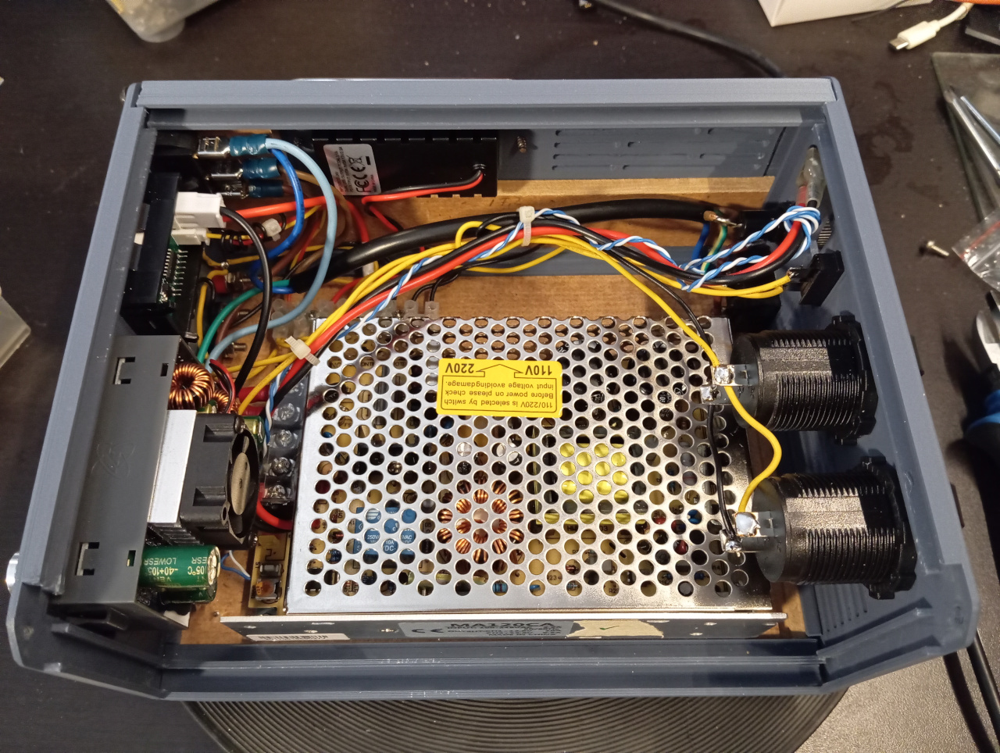

# DIY bench power supply

Some months ago, a friend gave me a pile of broken 13.8V 10A switching power supplies (the ones with UPS feature). After repairing some of them, I decided to use one to build a custom and compact variable bench power supply for my lab.

This power supply can output 13.8V 10A on the main rail, and 0-36V 5A on variable secondary rail, via a stepup/stepdown converter.

To avoid long 3D printing times (and also to obtain a nice looking), I designed it to use MDF panels, using scrap IKEA parquet I had lying around.

For the labels on the front side I tried the **inlay two colors printing technique**. But probably due to the filament quality I've used (the orange one), I was not able to obtain a good result.
How it works: load your printer with the filament for the inlay and print it. Then change filament with the color to use for the body (gray, in my case), and print **over** the inlay you just printed (without removing it from plate!), using **Z Hop** feature with a value slightly higher than inlay height (0.06, in my case, since my inlay is just 0.04mm thick).

In this repository you can find all the needed STL parts for 3D printing and the source design, made in Blender (feel free to modify it to suit your needs).
Corner sides can be printed at 45 degrees.

## Tools and materials needed
- a 3D printer (of course);
- scrap wood / MDF panels (I used IKEA TUNDRA parquet, 7mm thick);
- Rocker switch 3 Pins 2 Positions: https://www.aliexpress.com/item/1005007129133679.html
- digital voltmeter/ammeter DC 100V 10A 0.28 Inch: https://www.aliexpress.com/item/1005005631411872.html
- DC Buck Boost Converter Adjustable Voltage Current Regulator Constant 6-36V 80W: https://www.aliexpress.com/item/1005005513823999.html
- 4 Positions Spring Connector Terminal: https://www.aliexpress.com/item/1005002148258217.html
- 4mm Banana Plug Connectors: https://www.aliexpress.com/item/1005006406536395.html
- USB charger module: https://www.aliexpress.com/item/1005007125414869.html
- car cigarette lighter socket 12V/24V: https://www.aliexpress.com/item/1005006639542753.html
- automotive fuse holder: https://www.aliexpress.com/item/1005006124536260.html
- glass fuse holder 5x20: https://www.aliexpress.com/item/32873374711.html
- panel mount IEC connector for main supply (sorry, I took this from an old PC psu)
